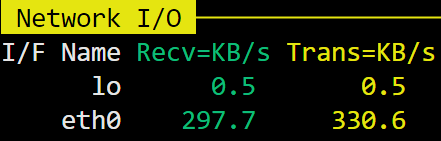
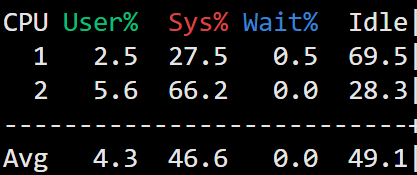
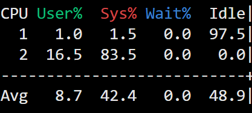
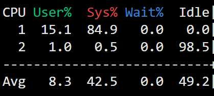

# 中继服务器任务报告
[toc]
说明：本报告基于v1.0进行的测试。
## 1 项目背景
### 1.1 中继服务器
中继服务器是一种位于客户端和目标服务器之间的服务器，用于将客户端的请求转发到目标服务器上。中继服务器通常被用来实现**负载均衡、缓存、作为防火墙的一部分拦截恶意请求和攻击、压缩数据提高传输速度或格式转换、隐藏真实IP**等。

---

本项目将实现一个简单的中继服务器，其功能为转发收到的数据：

图一 中继服务器示意图

客户端决定要发送的数据及发往的回射服务器，与中继服务器建立连接后将其发送给中继服务器，由中继服务器转发给目的回射服务器；回射服务器收到数据后将其回射给原客户端，此过程同样也经过中继服务器。

### 1.2 原理介绍
#### 1.2.1 TCP Socket模型
Socket模型是一种用于网络通信的编程模型，它允许应用程序通过网络套接字(Socket)发送和接收数据。其特别之处在于**可以跨主机通信**。

图二 TCP Socket模型

服务器：
* `socket()`：创建套接字
* `bind()`：给该套接字绑定IP地址和端口
  * 绑定IP地址的目的：一台机器可以有多个网卡，每个网卡都有对应的IP地址，当绑定一个网卡时，内核收到该网卡上的包，才会发给我们
  * 绑定端口的目的：当内核收到TCP报文，通过TCP头里面的端口号找到对应的应用程序，将数据传递给该应用程序
* `listen()`：监听
* `accept()`：从内核获取客户端的连接，如果没有客户端连接将阻塞等待

---

客户端：
* `connect()`：与服务器建立连接  

---

`send()`/`recv()`：发送/接收数据
`close()`：回收套接字

#### 1.2.2 改进I/O模型
一个TCP连接由一个套接字对唯一确定：`(本机IP，本机端口，对端IP，对端端口)`，所以`服务器最大TCP连接数 = 客户端IP数 × 客户端端口数`
对于IPv4，IP数最多为$2^{32}$，端口数最多为$2^{16}$，服务器最大TCP连接数可达$2^{48}$。但服务器承载不了那么大的连接数，主要受两个方面的限制：
1. 文件描述符
socket实际上是一个文件，也就会对应一个文件描述符。在Linux下，单个进程打开的文件描述符有限制，但是可以通过ulimit增大文件描述符的数目  

2. 系统内存
每个TCP连接在内核中都有对应的数据结构，这意味着**每个连接都会占用内存**。

---

原始的TCP Socket模型**只能一对一通信**，需要每个客户端一个一个**依次服务**，效率非常低下。  
传统上使用**多进程模型**和**多线程模型**解决这个问题。但是如果**为每个客户都维护一个进程/线程**，系统内存将很快被用完。
从而还是需要一个进程/线程来维护多个socket，即**I/O多路复用技术**。Linux提供了select/poll/epoll给用户多路复用：
- `select`
允许监控多个文件描述符，直到至少一个准备就绪。采用的是**轮询**来测试是否就绪。**可监控的文件描述符数量不能超过FD_SETSIZE**。  

- `poll`
类似select，也是**轮询**，但其使用了pollfd的数据结构，突破了可监控的限制。  

- `epoll`
epoll在内核维护了一个实例，存储了感兴趣的文件描述符和就绪列表。采用了**回调方式**来检测就绪事件：
epoll通过epoll_ctl()来**注册**一个文件描述符，当该文件描述符**就绪时**，内核会**采用回调机制激活**该文件描述符，当调用epoll_wait()时会得到通知，所以**epoll在有大量空闲连接时，效率远高于select和poll**。

所以本项目将基于epoll实现。

## 2 详细设计
### 2.1 总体框架

图三 类图

### 2.2 关键流程
#### 2.2.1 中继服务器流程图

图四 中继服务器流程图

#### 2.2.2 压力发生器流程图

图五 压力发生器流程图

压力发生客户端与回射服务端**继承于同一客户端类**，各自接收数据与发送数据的**实现不同**，在主函数中利用**多态**调用。

图六 压力发送端流程图

为保证中继服务器的功能性为第一要义，若测试过程中遇到回射回来的报文与原始报文不符，则停止测试。

图七 回射服务端流程图

### 2.3 缓冲区设计

图八 缓冲区示意图

如上图，中继服务器为每个客户端分配了一块缓冲区，缓冲区大小**不小于**报头的大小，用了四个指针来实现非阻塞的读写操作。

- 读：  
  1. 读id
  `ptr_recv_end`置于**id**大小的位置，非阻塞读取**id**时根据读取的数据大小改变`ptr_recv_start`的位置，读取完后重置`ptr_recv_start`，且将`ptr_recv_end`置于**报头**大小的位置，等待读取报头。
  2. 读报头
  非阻塞读取**报头**时根据读取的数据大小改变`ptr_recv_start`的位置，读取完后根据报头中**数据长度**将`ptr_recv_end`往后置，最多置于**缓冲区末端**。更新`ptr_send_end`的位置于`ptr_recv_start`，开始转发数据。
  3. 读数据
  非阻塞读取**数据**时根据读取的数据大小改变`ptr_recv_start`的位置和`ptr_send_end`的位置，并且记录还有多少数据没有读，如果`ptr_recv_start`位于缓冲区末端且数据没有读完，则将其置于缓冲区始端，更新`ptr_recv_end`的位置，**其位置不能超过`ptr_send_start`**。
- 写：
  非阻塞写入时，根据写入的数据大小改变`ptr_send_start`的位置，如果`ptr_send_start`位于缓冲区末端，则将其置于缓冲区始端，更新`ptr_send_end`的位置，**其位置不能超过`ptr_recv_start`**。

### 2.4 报文设计

图九 报文结构

报文主要分为两部分：
1. 报文头：源id，目的id，报文数据长度  
2. 报文数据

中继服务器收到报文头得知目的id后，立即开始转发任务，直到报文数据全部转发完。回射服务器收到报文头后，调转报文头中的源id与目的id，再开始回射任务。

## 3 代码实现
### 3.1 目录组织
.  
├── doc     // 报告
│$\qquad$└── doc/res // 资源  
├── include // 头文件  
└── src     // 源文件  

### 3.2 测试
测试环境：
|测试模块|硬件设备|CPU|内存|
|--|--|--|--|
|中继服务器|华为云耀云服务器L实例|General Purpose Processor|1GB|
|压力发生器|surface pro 6|Intel(R) Core(TM) i5-8250U CPU @ 1.60GHz|3GB|

#### 3.2.1 功能测试

本项目通过**循环缓冲区**来实现中继转发/回射。故要保证转发/回射时超过原始缓冲区大小时的指针处理。
设计了三个测试：
1. 缓冲区大小**等于**报文头大小
缓冲区大小设置为12B
2. 缓冲区大小**大于**报文头大小且**小于**报文整体大小
缓冲区大小设置为20B，报文整体大小为报文数据10B+报文头大小12B
3. 缓冲区大小**大于**报文整体大小
缓冲区大小设置为20B，报文整体大小为报文数据1B+报文头大小12B

若发生器运行过程中终止，并输出“**压力发生器接收到错误的回射信息**”则测试失败。

#### 3.2.2 报文大小：10B

|会话数|每秒转发报文数|平均延迟(ms)|网络速率(KB/s)|CPU占用率(%)|
|:---:|:---:|:---:|:---:|:---:|
|10|98|200.282|||
|100|938|202.861|||
|500|2318|384.195||
|1000|1908|651.707|||
|2400|1958|1516.38|||
|4800|1474|3306.56||

#### 3.2.3 报文大小：128B
|会话数|每秒转发报文数|平均延迟(ms)|网络速率(KB/s)|CPU占用率(%)|
|:---:|:---:|:---:|:---:|:---:|
|10|98|200.39||
|100|905|203.044||
|500|1400|645.429||
|1000|1248|1010.89|||
|2400|771|1955.8||
|4800|610|4283.26||

#### 3.2.4 报文大小：1KB

|会话数|每秒转发报文数|平均延迟(ms)|网络速率(KB/s)|CPU占用率(%)|
|:---:|:---:|:---:|:---:|:---:|
|10|95|204.737||
|100|404|451.399||
|500|358|1285.69||
|1000|318|1551.88||
|2400|209|4027.79||
|4800|219|10919.6||

#### 3.2.5 报文大小：16KB
|会话数|每秒转发报文数|平均延迟(ms)|网络速率(KB/s)|CPU占用率(%)|
|:---:|:---:|:---:|:---:|:---:|
|10|24|689.21||
|100|26|2442.9||
|500|23|7730.43||
|1000|27|14514.4||
|2400|24|20101.6||
|4800|17|55171.9||

#### 3.2.6 报文大小：32KB
|会话数|每秒转发报文数|平均延迟(ms)|网络速率(KB/s)|CPU占用率(%)|
|:---:|:---:|:---:|:---:|:---:|
|10|12|1120.01||
|100|13|5819.23||
|500|13|12924||
|1000|13|17083||
|2400|13|38476.3||
|4800|8|122354||

#### 3.2.7 报文大小：64KB
|会话数|每秒转发报文数|平均延迟(ms)|网络速率(KB/s)|CPU占用率(%)|
|:---:|:---:|:---:|:---:|:---:|
|10|6|2582.92||
|100|6|11301.1||
|500|7|23204.9||
|1000|7|34825.1||
|2400|6|87529.1||
|4800|大量断连|

#### 3.2.8 报文大小：128KB
|会话数|每秒转发报文数|平均延迟(ms)|网络速率(KB/s)|CPU占用率(%)|
|:---:|:---:|:---:|:---:|:---:|
|10|3|4490.84||
|100|3|17677||
|500|3|36725.7||
|1000|3|74555.3||
|2400|大量断连
|4800|大量断连

#### 3.2.9 12小时压力测试
建立2000个稳定会话(即4000个客户端，压力发生器和中继服务器各2000)持续向中继服务器收发数据，报文大小1KB。
另随机若干个临时会话在收发随机(10-50)个测试数据后主动断开连接，报文大小同样是1KB。

##### 压测结果：
|每秒转发报文数|平均延迟(ms)|
|:---:|:---:|
|347.434|751.897|

在大约10小时时看到中继服务器仍在运行，并且CPU占用率100%：

 10h时top命令输出 

但是此刻的连接数为2450，如下图：

 10h时客户端连接数 

12小时过后查看服务器：

 12h过后top命令输出 

此时的连接数为：

 12h后客户端连接数 

相较于10h，又断开了两个客户端。
查看调试信息发现有大量的`Connection timed out`。

#### 3.2.10 valgrind内存泄漏测试

 valgrind运行结果 

没有内存泄漏

#### 3.2.11 更新测试
##### 3.2.11.1 v1.1
|会话数|每秒转发报文数|平均延迟(ms)|网络速率(KB/s)|CPU占用率(%)|
|:---:|:---:|:---:|:---:|:---:|
|10|162|122.39||
|1000|390|822.202||

会话数为10，报文大小为1KB时，相较于v1.0，v1.1的每秒转发报文数从95提升到162，平均延迟从204.737ms缩小到122.39ms。网速从118KB/s提升到190.1KB/s，cpu占用率显著降低。
会话数为1000，报文大小为1KB时，相较于v1.0，v1.1的每秒转发报文数从318提升到390，平均延迟从1551.88ms缩小到822.202ms。网速变化不大，cpu占用率降低。

### 3.3 程序分析
### 3.3.1 v1.0

 中继服务器gprof图 

中继服务器大量时间在调用`SendData()`上，其中调用`GetBuffer()`和`GetSendEnd()`也占据大量时间。理论上返回一个指针并不会占据大量时间，很有可能在Epoll循环中，中继服务器企图发送数据但**每次发送的数据量较少**（甚至没有）增加了调用次数（对面接收的慢）或**有可写事件但没有可发送数据**（自己接收的慢）。

 压力发生器gprof图 

从上图中可以看到压力发生器的大量时间在发送数据特别是压力发生客户端上。由于是**单线程**的，导致作为回射服务器的客户端一直没获得充足的cpu时间。

### 3.3.2 v1.1

只能看到一个线程的运行情况。**gprof不支持多线程程序。**

 中继服务器gprof图 

从上图可以看到，相较于v1.0，多了很多调用，主要是因为采用了多线程，有很多线程的底层调用。且一开始没有开启写监听，导致每次读到数据后，需要从map中找到对应的fd开启写监听。这个找的过程是map底层的红黑树的查找，现在占程序的大量事件。当初在设计时，为了兼容各种身份标识符（本项目中是id）的快速索引没有采用散列表，而是计划使用B+树，所以暂时采用了红黑树代替。

## 4 版本更新：
### 4.1 v1.0
基础版本。本报告基于v1.0，其他版本的测试数据会另添说明。
### 4.2 v1.1：
  1. 服务器更改为多线程策略。一个线程负责接收连接请求，一个线程负责IO处理。
  2. 服务端的epoll中先不监听可写事件，待接收到数据时才打开对应的可写监听，写完**可写数据**后关闭可写监听。
  3. 压力发生器改为多线程策略。多个线程均摊压力发生端，多个线程均摊回射端。
  4. 压力发生器中回射端在写完**可写数据**后关闭可写监听，接收到数据后再打开可写监听。
  5. 修改了调用`recv()`时，len填0导致给对面发送rst的bug。
  6. 采用非阻塞connect，增加超时重连功能。

## 5 总结
压力发生器**没有使用非阻塞connect**，导致会话数量很大时，建立连接耗时很长，从而影响了平均转发报文数。后来通过多线程建立连接得到了改善。使用非阻塞connect会在收发数据过程中发生大量的客户端断线，目前还没有解决这个问题。
压力发生器的设计将压力发生客户端和回射客户端牢牢地用单线程捆在了一起。导致性能互相影响，从而影响了中继服务器的表现。

中继服务器是**单线程**的。在建立大量会话后，再去建立新的连接，很容易发生连接超时，即中继服务器忙于转发服务，建立连接的优先级等同于读写的优先级，导致得不到连接服务。应该至少设计成两个线程，一个用于接收新连接，一个用于转发服务。

在长时间压测和大量会话大报文的测试中，均出现了大量客户端断连的情况。使用`netstat`发现连接数一直在下降，但是调试信息中没有即时的断连。说明在EPOLL主循环中，一直在处理IO事件，没有即时地处理到断连。应该使用多线程去执行IO操作，涉及到**对缓冲区各种指针的加锁**，由于本次项目遇到的最大的困难就是服务器循环缓冲区的指针移动，所以暂时放弃了使用多线程实现IO。
由于EPOLL主循环一直在处理IO事件，在大量会话建立的情况下，由于单线程的限制，存在大量客户端的缓冲区堆满，由于TCP的**流量控制**，**在最后一次返回ACK时会告诉对面接收窗口为0，对面会暂时停发数据，并开启定时器定期发送侦测包侦测接收窗口的大小**。

想通过tcpdump抓包分析断线原因：

 tcpdump抓包结果 

如图，`Flags[R]`表示RST标志，中继服务器异常关闭了该连接。具体原因暂时还没想明白。
可能的原因：
  - `recv()`里面的len填0会给对面发一个RST。
  POSIX标准规定要大于0，否则会发生未定义行为。本项目中，会因为**缓冲区没空间**导致在有可读事件下，len为0，但是若先判断有可读空间再调用`recv()`，又会错过断线信息。

## 6 参考
[I/O 多路复用：select/poll/epoll](https://www.xiaolincoding.com/os/8_network_system/selete_poll_epoll.html)
[select/poll/epoll对比分析](https://gityuan.com/2015/12/06/linux_epoll/)
[tcpdump 命令](https://www.getiot.tech/zh/linux-command/tcpdump)
[tcptrack 命令](https://www.getiot.tech/zh/linux-command/tcptrack)
## 7 源码
[Github仓库地址](https://github.com/ChenNingjie1218/RelayServer)